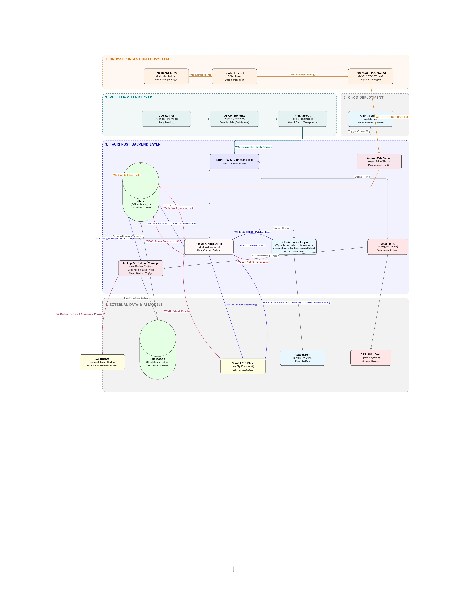

[📐 Project Architecture](https://drive.google.com/drive/folders/1HPm-OfIUxNmZBD-hPUmnSqStH3QZJt60?usp=sharing)

# RoleTect

[](https://addons.mozilla.org/en-US/firefox/addon/roletect-ingest/)
[📄 Read the RoleTect Report](./assets/RoleTectReport.pdf) — *Explains the architectural, business, and privacy value of RoleTect.*

RoleTect is a local-first, privacy-focused desktop application and companion browser extension designed to organize the job application process, parse job descriptions, and tailor LaTeX-based resumes and cover letters using on-device or API-driven AI models.

---

## 🏗️ System Architecture

The following diagram illustrates how the components of RoleTect interact, from web scraping to secure key retrieval, database storage, and local compilation.



---

## 🎯 Core Features & Technical Implementation

### 1. Zero-Trust API Key Storage (IOTA Stronghold Enclave)
*   **The Issue:** Storing API keys in plaintext files or standard databases leaves them vulnerable to extraction by local malware.
*   **The Solution:** RoleTect utilizes `tauri-plugin-stronghold` to create an encrypted database enclave (`secrets.stronghold`) utilizing Argon2 key derivation.
*   **Runtime Security:** A cryptographically random 256-bit passkey is generated at first run and stored locally. API credentials are decrypted on-the-fly inside Rust command memory only when executing AI calls, and are never saved to the SQLite database.

### 2. Dual-Purpose Local Axum Server
*   **Dynamic Port Bindings & Auth:** At startup, the Tauri backend spins up an Axum server on an available port. The browser extension communicates using a dynamic 32-character secret key.
*   **Chunked PDF Streaming:** Beyond just receiving job payloads from the extension, the server is uniquely engineered to serve compiled PDFs back to the frontend chunk by chunk. This data-streaming architecture ensures that massive PDFs load instantly without freezing or slowing down the Vue 3 UI.

### 3. Token-Squashing Scraper Pipeline
*   **Efficiency:** Raw HTML bloats token counts and incurs unnecessary API costs.
*   **DOM Sanitation:** The extension cleans the webpage DOM before transmission, stripping scripts, CSS styles, images, inline SVGs, iframes, navbars, and buttons.
*   **Text Processing:** The content script runs a regex pipeline to collapse vertical spacing, convert returns into periods, eliminate horizontal gaps, and squash duplicate periods.

### 4. On-Device Tectonic LaTeX Compilation & Powerful IDE
*   **Architecture & Workaround:** To bypass the requirement of a system-wide LaTeX installation, RoleTect embeds the **Tectonic compiler** directly into a background thread. We solved persistent stack overflow issues with complex LaTeX templates by significantly increasing the thread stack size to 100MB.
*   **Pre-Caching for Offline Use:** We implemented a custom template that caches over 85 essential scientific and layout packages initially. This allows developers to run and compile complex documents completely offline after the initial setup.
*   **Workspace Performance:** The built-in LaTeX IDE provides a seamless, side-by-side editing experience with CodeMirror. It instantly compiles and previews PDFs without UI lag.

### 5. Advanced Job Application Workspace
*   **Side-by-Side Comparison:** Users can instantly toggle between their base resume/CV and the AI-tailored version to review exactly what the AI changed.
*   **Precision AI Input Box:** For any tailored job, users have an interactive AI input box to dictate specific changes—whether generating a brand new section from scratch or updating a specific bullet point to better match the job requirements.
*   **Self-Healing Compilation:** RoleTect leverages the Rig AI library for self-healing pipelines. If the AI-generated LaTeX compiles successfully, it is saved automatically. If compilation fails, the system catches the error logs and provides a one-click "AI Fix" option to automatically debug and resolve syntax issues.

### 6. S3 Cloud Backup & Complete Offline Capability
*   **S3 Cloud Sync:** Users can securely back up their entire SQLite database and workspaces to an S3-compatible cloud (AWS, Cloudflare R2, etc.). S3 credentials are saved securely in the OS keyring (Stronghold).
*   **Intelligent Restore:** When restoring, users have the option to safely merge cloud data with their local database or completely overwrite it. 
*   **Graceful Shutdown:** The app purposefully delays closing to ensure auto local and cloud backups complete successfully.
*   **Multi-Provider LLM & Offline AI:** Integrates with Gemini, OpenAI, Anthropic, Groq, and Bedrock. If a user's computer can handle powerful models, they can route all AI tailoring and debugging through Ollama. Combined with the pre-cached LaTeX packages, the entire application can run 100% offline.

### 7. AI-Assisted Technical Diagramming Workspace
*   **Interactive Visual Canvas:** Incorporates a dedicated workspace for creating, editing, and rendering Mermaid.js flowcharts, sequence diagrams, and ER diagrams.
*   **Interactive Panning & Zooming:** Uses `svg-pan-zoom` to allow users to interact with large, complex layouts.
*   **AI Synthesis & Repair:** Features specialized commands (`refine_diagram_with_ai`, `fix_diagram_with_ai`) that use AI to dynamically build, refine, and debug diagrams from conversational natural language instructions.

---

## 📂 Project Structure

```text
├── application/             # Standalone assets & icons
├── src-tauri/               # Tauri Rust Backend
│   ├── src/
│   │   ├── commands/        # Tauri command handlers (settings, compiler, database)
│   │   ├── ai.rs            # Rig LLM integration & prompt templates
│   │   ├── db.rs            # rusqlite database initialization and migrations
│   │   ├── lib.rs           # Tauri app setup & plugin registration
│   │   └── server.rs        # Axum local server
│   └── Cargo.toml           # Rust backend dependencies
├── src/                     # Vue 3 Frontend
│   ├── components/          # Views & UI Components (Editor, Job Tracker, Settings)
│   ├── store/               # Pinia State Management (Settings, Jobs, Resumes)
│   └── App.vue              # Main App wrapper
├── extentions/              # Browser Extensions
│   ├── chrome/              # Manifest V3 extension code
│   └── firefox/             # Firefox compatible manifest extension code
└── README.md
```

---

## 🚀 Installation & Setup

### 1. Standard Installation (Recommended)
The easiest way to get started is to download the pre-compiled application and official extension.

*   **Desktop App:** Download the latest installer for your operating system from the [Releases](https://github.com/AhmedTrooper/RoleTect/releases) page.
*   **Browser Extension:** Install the official companion extension to scrape and send job descriptions to the app.
    *   **Firefox Users:** [🦊 Install Firefox Add-on](https://addons.mozilla.org/en-US/firefox/addon/roletect-ingest/) (Available Now)
    *   **Chrome/Edge Users:** Download the `roletect-chrome-extension.zip` file from the [Releases](https://github.com/AhmedTrooper/RoleTect/releases) page. Extract the zip file, navigate to `chrome://extensions` in your browser, enable **Developer Mode**, click **Load unpacked**, and select the extracted folder.

> **Connecting the Extension:** Once installed, click the extension icon in your browser. Copy the **Secret Key** and **Active Server Port** from the *Inbox* or *Settings* tab in the RoleTect desktop app and paste them into the extension to authenticate the secure connection.

---

### 2. Developer Setup & Local Execution
If you wish to build from source or install the appication manually:

#### Prerequisites
*   [Node.js](https://nodejs.org/) (v18+)
*   [Rust Compiler & Cargo](https://www.rust-lang.org/)
*   [Bun Package Manager](https://bun.sh/) (Recommended, or npm)

#### Backend & Frontend Build
1.  **Clone the Repository:**
    ```bash
    git clone https://github.com/AhmedTrooper/RoleTect.git
    cd RoleTect
    ```
2.  **Install Dependencies:**
    ```bash
    bun install
    # or npm install
    ```
3.  **Run Development Environment:**
    ```bash
    bun run tauri dev
    # or npm run tauri dev
    ```


---

## 📊 Model & Data Card

### 1. Model Summary
*   **Recommended Models:** `gemini-1.5-pro` / `gemini-1.5-flash` (via Google AI Studio), `gpt-4o` / `gpt-4o-mini` (via OpenAI), or `llama3-70b-8192` (via Groq).
*   **Local Inference:** Compatible with any GGUF running via `ollama` locally (e.g., `llama3:8b`).
*   **AI Roles:**
    *   **Parser:** Evaluates raw text/URL crawled data and maps it to a JSON schema defining validation properties (job details, responsibilities, requirements).
    *   **Tailoring Engine:** Injects matching skills and structural details directly into LaTeX resume structures while conserving compilability.
    *   **Debugger:** Ingests Tectonic error logs and broken code strings to resolve LaTeX syntax errors.

### 2. Data Processing Policy
*   **Zero-Cloud Storage:** RoleTect operates no remote application servers. Job details, resumes, templates, and application progress remain in a local SQLite file.
*   **Inference Path:** Data sent to LLMs is routed directly from the desktop client to the selected API provider endpoint via HTTPS. No third-party relays are used.

### 3. Limitations & Considerations
*   **Initial Compiler Latency:** On its first run, the Tectonic engine downloads compiler assets to compile document structures. Subsequent runs utilize the local Tectonic cache.
*   **Offline Compilation:** While LaTeX PDF generation is 100% offline, AI-based parsing and tailoring require a network connection unless a local model is running via Ollama.

---

## 🔓 Open-Source Attribution & Licensing Directory

In compliance with **Section 10.2** of the SciBlitz AI Challenge 2026 Rulebook, below is the comprehensive attribution list of third-party open-source libraries, engines, and AI models utilized in the development of RoleTect.

### 1. Backend Core & Plugins (Rust)
*   **Tauri v2 Framework** (MIT / Apache-2.0) | Cross-platform runtime orchestration.
*   **Tectonic Engine** (MIT) | Self-contained LaTeX-to-PDF compiler.
*   **Rig AI Framework** (MIT) | Declarative agent structures & LLM connector.
*   **Axum & Tokio** (MIT) | Non-blocking web server and async execution runtime.
*   **IOTA Stronghold** (Apache-2.0 / MIT) | Argon2 secure local database enclave.
*   **rusqlite** (MIT) | Native SQLite wrapper for local relational tracking.
*   **tower-http** (MIT) | CORS and network request middleware layers.

### 2. Frontend Application (Vue 3 / TypeScript)
*   **Vue 3** (MIT) | Declarative user interface runtime.
*   **Vite** (MIT) | Frontend bundler and build system.
*   **Pinia** (MIT) | Global state stores for configurations and workspace files.
*   **CodeMirror** (MIT) | In-browser LaTeX editor canvas.
*   **DOMPurify** (Apache-2.0) | HTML sanitization preventing XSS during ingestion.
*   **Mermaid.js** (MIT) | Client-side markup diagram renderer.
*   **Motion-V** (MIT) | UI transition and micro-animation engine.
*   **svg-pan-zoom** (MIT) | Interactive PDF preview panning tools.

### 3. Pre-trained AI Models (Third-party)
*   **Gemini 1.5 Pro & Flash** (Google AI Studio Terms of Service) | Used for structured job schema parsing and resume template tailoring.
*   **GPT-4o & GPT-4o-mini** (OpenAI APIs Terms of Service) | Supported alternative routing models.
*   **Claude 3.5 Sonnet** (Anthropic API Terms of Service) | High-fidelity LaTeX syntax debugging.
*   **Llama 3 (8B/70B)** (Meta LLaMA 3 License Agreement) | Local inference compatible model via Ollama.
